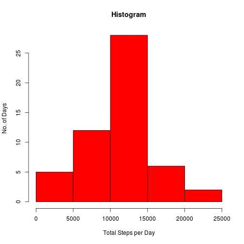
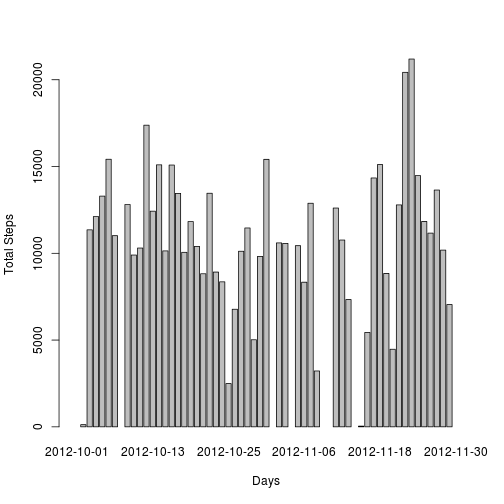
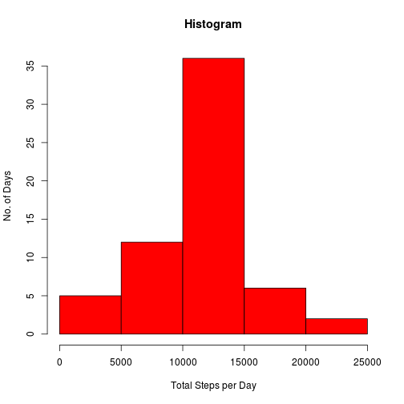
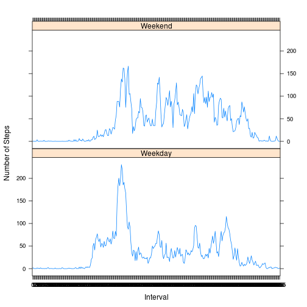

### LOADING AND PREPROCESSING THE DATA


```r
temp<-tempfile(fileext=".zip")
fileurl<-"http://d396qusza40orc.cloudfront.net/repdata%2Fdata%2Factivity.zip"
download.file(fileurl,temp)
df<-read.csv(unzip(temp))
```

WHAT IS THE MEAN TOTAL NUMBER OF STEPS TAKEN PER DAY?

Here , due to some ambiguity, I am going to present two approaches to this question.*First* I will show you histogram of the _total number of steps_ taken each day i.e on the X axis will be the possible values of total steps and on the Y axis will be the number of days on which such number of total steps were taken .Here is the code:


```r
a<-tapply(df$steps,df$date,sum)
b<-as.numeric(a)
new_df<-data.frame("date"=names(a),"tsteps"=b)
hist(new_df$tsteps,col="red",xlab="Total Steps per Day",ylab="No. of Days",main="Histogram")
```

 

Another interpretation of histogram (technically " a barplot") can be that in the X axis are shown the different days and on the Y axis are shown the corresponding total steps that were taken on that particular day. Here is the code

```r
barplot(new_df$tsteps,names.arg=new_df$date,xlab="Days",ylab="Total Steps")
```

 


The mean is given by

```r
mean(new_df$tsteps,na.rm=TRUE)
```

```
## [1] 10766
```
The median is given by

```r
median(new_df$tsteps,na.rm=T)
```

```
## [1] 10765
```

### What is the average daily activity pattern?


```r
df$interval<-factor(df$interval)
avg_pattern<-tapply(df$steps,df$interval,mean,na.rm=T)
plot(names(avg_pattern),as.numeric(avg_pattern),type="l",xlab="Intervals",ylab="Average")
```

 


#### Which 5 minute interval ,on average,across all days contains the maximum number of steps?


```r
names(which.max(avg_pattern))
```

```
## [1] "835"
```

```r
avg_pattern[which.max(avg_pattern)]
```

```
##   835 
## 206.2
```

###Inputing Missing Values

Calculate and report the missing values in the dataset.

```r
sum(is.na(df))
```

```
## [1] 2304
```

Strategy for filling in all the missing values in the new dataset.

```r
new_dataset<-df
for( i in 1:nrow(df)){
  rec<-df[i,]
  if(is.na(rec$steps)){
    new_dataset[i,]$steps<-avg_pattern[as.character(rec$interval)]
  }
}
```
Make a histogram of the total number of steps taken each day and Calculate and report the mean and median total number of steps taken per day. Do theses values differ from the estimates from the first part of the assignment. What is the impact of imputing missing on the estimates of the total daily number of steps?


```r
a<-tapply(new_dataset$steps,new_dataset$date,sum)
b<-as.numeric(a)
new_df<-data.frame("date"=names(a),"tsteps"=b)
hist(new_df$tsteps,col="red",xlab="Total Steps per Day",ylab="No. of Days",main="Histogram")
```

 
The mean is given by

```r
mean(new_df$tsteps)
```

```
## [1] 10766
```
The median is given by

```r
median(new_df$tsteps)
```

```
## [1] 10766
```
We see the Mean is same but the median value is different.

### Are there differences in activity patterns between weekdays and weekends?

```r
new_dataset$day<-weekdays(as.Date(new_dataset$date))
for (i in 1:length(new_dataset$day)){
  if (new_dataset[i,]$day=="Saturday"|new_dataset[i,]$day=="Sunday"){
    new_dataset[i,]$day<-"Weekend"
  }
  else{
    new_dataset[i,]$day<-"Weekday"
  }
}
new_dataset$day<-factor(new_dataset$day)
```

```r
library(plyr)
avg<-ddply(new_dataset,.(interval,day),summarize,average=mean(steps))
library(lattice)
xyplot(average~interval|day,avg,type="l",layout=c(1,2),xlab="Interval",ylab="Number of Steps")
```

 
